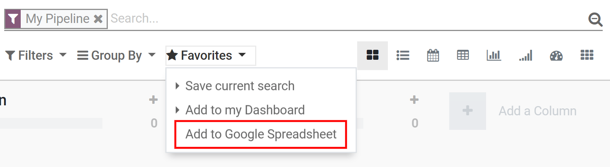
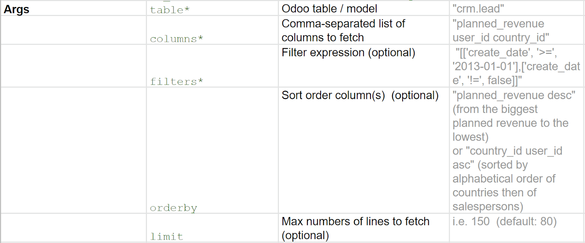

=====================================================
How to use Google Spreadsheet in Addition to my Data?
=====================================================

Create custom dashboards in Google Spreadsheet that retrieves data directly from Thrive Bureau ERP using
spreadsheet formula. You can use it to create sales commission plans, budgets, project forecasts,
etc. Formulas are written in Python but programming skills are not required.

Configuration
=============

From the *General Settings*, activate *Google Drive* and *Google Spreadsheet*. The options
*Authorization Code* and *Get Authorization Code* are now available.

.. image:: google_spreadsheets/authori.png
   :align: center
   :alt: Enable the Google Drive and Google Spreadsheet features in Thrive Bureau ERP

Now, link your Google account with Thrive Bureau ERP by following these steps:

#. Get Authorization Code
#. Select your Google account
#. Enter your password
#. Copy the code
#. Paste it into the Authorization Code field

Create a new Spreadsheet
------------------------

From the *CRM* app, for example, go to *Favorites* and click on *Add to Google Spreadsheet*.

A new spreadsheet will be automatically created in your Google Drive.

.. note::
   When you opening this new file, a second sheet is created automatically by Thrive Bureau ERP with a
   tutorial/documentation on *How to use Google Spreadsheet*.

Link a Spreadsheet with Thrive Bureau ERP
----------------------------

| From this new file, configure your database.
| Go to :menuselection:`Thrive Bureau ERP --> Server Settings --> Database Name --> Username --> Password`.

.. image:: google_spreadsheets/Thrive Bureau ERP_menu.png
   :align: center
   :alt: Menu called Thrive Bureau ERP is shown on the settings bar in the Spreadsheet

Applications
============

You have two different formulas available when using Google Spreadsheet in Thrive Bureau ERP: *retrieve data* and
*retrieve grouped sums*.

.. warning::
   Google Drive limits the execution time of scripts; if the data you requested takes
   too long to be delivered, you might get an error. There is no specific size limit, since the
   time for Thrive Bureau ERP to respond depends on several factors - although reading data regarding several
   thousand records is usually fine.

Retrieve Data
-------------

| The theoretical formula is :command:`= oe_browse (table;columns;filters;orderby:limit)`.
  Used it if you want to display the information without grouping it (e.g.: each sales
  order in the database).
| Find some the arguments in the table below.

Retrieve Grouped Sums
---------------------

| The theoretical formula is :command:`= oe_read_group (table;columns;group_by;filters;orderby:limit)`.
  Use it when you want to display a sum of data (e.g.: total invoiced).
| Find some arguments in the table below.

.. image:: google_spreadsheets/retrieve_sums.png
   :align: center
   :alt: Table with examples of grouped sum arguments to use in Thrive Bureau ERP

Other uses
----------

Mix Thrive Bureau ERP data with spreadsheet data, add traditional formulas, and create Dynamic Tabled and Graphs.
