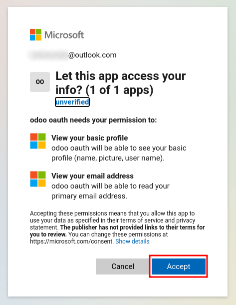

======================================
Microsoft Azure sign-in authentication
======================================

The Microsoft Azure OAuth sign-in authentication is a useful function that allows Thrive Bureau ERP users to sign
in to their database with their Microsoft Azure account.

This is particularly helpful if the organization uses Azure Workspace, and wants employees within
the organization to connect to Thrive Bureau ERP using their Microsoft Accounts.

.. seealso::
   - :doc:`../../productivity/calendar/outlook`
   - :doc:`/administration/maintain/azure_oauth`

Configuration
=============

Integrating the Microsoft sign-in function requires configuration on Microsoft and Thrive Bureau ERP.

Thrive Bureau ERP System Parameter
---------------------

First activate the :ref:`developer mode <developer-mode>`, and then go to :menuselection:`Settings
--> Technical --> System Parameters`.

Click :guilabel:`Create` and on the new/blank form that appears, add the following system parameter
`auth_oauth.authorization_header` to the :guilabel:`Key` field, and set the :guilabel:`Value` to
`1`. Then click :guilabel:`Save` to finish.

Microsoft Azure dashboard
-------------------------

Create a new application
~~~~~~~~~~~~~~~~~~~~~~~~

Now that the system parameters in Thrive Bureau ERP have been set up, it's time to create a corresponding
application inside of Microsoft Azure. To get started creating the new application, go to
`Microsoft's Azure Portal <https://portal.azure.com/>`_. Log in with the :guilabel:`Microsoft
Outlook Office 365` account if there is one, otherwise, log in with a personal :guilabel:`Microsoft
account`.

.. important::
   A user with administrative access to the *Azure Settings* must connect and perform the following
   configuration steps below.

Next, navigate to the section labeled :guilabel:`Manage Azure Active Directory`. The location of
this link is usually in the center of the page.

Now, click on the :guilabel:`Add (+)` icon, located in the top menu, and then select :guilabel:`App
registration` from the drop-down menu. On the :guilabel:`Register an application` screen, rename the
:guilabel:`Name` field to `Thrive Bureau ERP Login OAuth` or a similarly recognizable title. Under the
:guilabel:`Supported account types` section select the option for :guilabel:`Accounts in this
organizational directory only (Default Directory only - Single tenant)`.

.. warning::
   The :guilabel:`Supported account types` can vary by Microsoft account type and end use of the
   OAuth. For example: Is the login meant for internal users within one organization or is it meant
   for customer portal access? The above configuration is used for internal users in an
   organization.

   Choose :guilabel:`Personal Microsoft accounts only` if the target audience is meant for portal
   users. Choose :guilabel:`Accounts in this organizational directory only (Default Directory only -
   Single tenant)` if the target audience is company users.

Under the :guilabel:`Redirect URL` section, select :guilabel:`Web` as the platform, and then input
`https://<Thrive Bureau ERP base url>/auth_oauth/signin` in the :guilabel:`URL` field. The Thrive Bureau ERP base :abbr:`URL
(Uniform Resource Locator)` is the canonical domain at which your Thrive Bureau ERP instance can be reached (e.g.
*mydatabase.Thrive Bureau ERP.com* if you are hosted on Thrive Bureau ERP.com) in the :guilabel:`URL` field. Then, click
:guilabel:`Register`, and the application is created.

Authentication
~~~~~~~~~~~~~~

Edit the new app's authentication by clicking on the :guilabel:`Authentication` menu item in the
left menu after being redirected to the application's settings from the previous step.

Next, the type of *tokens* needed for the OAuth authentication will be chosen. These are not
currency tokens but rather authentication tokens that are passed between Microsoft and Thrive Bureau ERP.
Therefore, there is no cost for these tokens; they are used merely for authentication purposes
between two :abbr:`APIs (application programming interfaces)`. Select the tokens that should be
issued by the authorization endpoint by scrolling down the screen and check the boxes labeled:
:guilabel:`Access tokens (used for implicit flows)` and :guilabel:`ID tokens (used for implicit and
hybrid flows)`.

.. image:: azure/authentication-tokens.png
   :align: center
   :alt: Authentication settings and endpoint tokens.

Click :guilabel:`Save` to ensure these settings are saved.

Gather credentials
~~~~~~~~~~~~~~~~~~

With the application created and authenticated in the Microsoft Azure console, credentials will be
gathered next. To do so, click on the :guilabel:`Overview` menu item in the left-hand column. Select
and copy the :guilabel:`Application (client) ID` in the window that appears. Paste this credential
to a clipboard / notepad, as this credential will be used in the Thrive Bureau ERP configuration later.

After finishing this step, click on :guilabel:`Endpoints` on the top menu and click the *copy icon*
next to :guilabel:`OAuth 2.0 authorization endpoint (v2)` field. Paste this value in the clipboard /
notepad.

.. image:: azure/overview-azure-app.png
   :align: center
   :alt: Application ID and OAuth 2.0 authorization endpoint (v2) credentials.

Thrive Bureau ERP setup
----------

Finally, the last step in the Microsoft Azure OAuth configuration is to configure some settings in
Thrive Bureau ERP. Navigate to :menuselection:`Settings --> Integrations --> OAuth Authentication` and check the
box to activate the OAuth login feature. Click :guilabel:`Save` to ensure the progress is saved.
Then, sign in to the database once the login screen loads.

Once again, navigate to :menuselection:`Settings --> Integrations --> OAuth Authentication` and
click on :guilabel:`OAuth Providers`. Now, select :guilabel:`New` in the upper-left corner and name
the provider `Azure`.

Paste the :guilabel:`Application (client) ID` from the previous section into the :guilabel:`Client
ID` field. After completing this, paste the new :guilabel:`OAuth 2.0 authorization endpoint (v2)`
value into the :guilabel:`Authorization URL` field.

For the :guilabel:`UserInfo URL` field, paste the following :abbr:`URL (Uniform Resource Locator)`:
`https://graph.microsoft.com/oidc/userinfo`

In the :guilabel:`Scope` field, paste the following value: `openid profile email`. Next, the Windows
logo can be used as the CSS class on the login screen by entering the following value: `fa fa-fw
fa-windows`, in the :guilabel:`CSS class` field.

Check the box next to the :guilabel:`Allowed` field to enable the OAuth provider. Finally, add
`Microsoft Azure` to the :guilabel:`Login button label` field. This text will appear next to the
Windows logo on the login page.

.. image:: azure/Thrive Bureau ERP-provider-settings.png
   :align: center
   :alt: Thrive Bureau ERP provider setup in the Settings application.

:guilabel:`Save` the changes to complete the OAuth authentication setup in Thrive Bureau ERP.

User experience flows
---------------------

For a user to log in to Thrive Bureau ERP using Microsoft Azure, the user must be on the :menuselection:`Thrive Bureau ERP
password reset page`. This is the only way that Thrive Bureau ERP is able to link the Microsoft Azure account and
allow the user to log in.

.. note::
   Existing users must :ref:`reset their password <users/reset-password>` to access the
   :menuselection:`Thrive Bureau ERP password reset page`. New Thrive Bureau ERP users must click the new user invitation link
   that was sent via email, then click on :guilabel:`Microsoft Azure`. Users should not set a new
   password.

To sign in to Thrive Bureau ERP for the first time using the Microsoft Azure OAuth provider, navigate to the
:menuselection:`Thrive Bureau ERP password reset page` (using the new user invitation link). A password reset
page should appear. Then, click on the option labeled :guilabel:`Microsoft Azure`. The page will
redirect to the Microsoft login page.

.. image:: azure/Thrive Bureau ERP-login.png
   :align: center
   :alt: Microsoft Outlook login page.

Enter the :guilabel:`Microsoft Email Address` and click :guilabel:`Next`. Follow the process to sign
in to the account. Should :abbr:`2FA (Two Factor Authentication)` be turned on, then an extra step
may be required.

.. image:: azure/login-next.png
   :align: center
   :alt: Enter Microsoft login credentials.

Finally, after logging in to the account, the page will redirect to a permissions page where the
user will be prompted to :guilabel:`Accept` the conditions that the Thrive Bureau ERP application will access
their Microsoft information.

